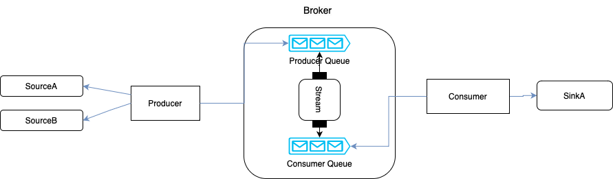

# Project Overview - Fixture Processor
This project is designed to demonstrate a data processing pipeline using RestTemplate, and queue as a broker.  
The pipeline consists of three main components: producer, broker, and consumer.  
The producer collects data from two sources (sourceA and sourceB) using RestTemplate, processes the data, and sends it to a producer Queue.  
The broker has two queues: a producer queue for incoming data and a consumer queue for processed data.  
The broker's streaming service processes messages from the producer queue, categorizes them as "joined" or "orphaned," and stores them in the consumer queue.  
Finally, the consumer reads messages from the consumer queue and calls a sink (e.g., an external API) to send all messages with their corresponding "joined" or "orphaned" states. 

1. ### Producer
   The producer component is responsible for fetching data from two sources (sourceA and sourceB) using RestTemplate. 
   It performs any necessary data processing and then sends the data to the broker's producer queue.

2. ### Broker
   The broker component acts as an intermediary between the producer and the consumer. It consists of two queues: 
   - **Producer Queue**: This queue receives incoming data from the producer. Messages in this queue are processed by the broker's streaming service. 
   - **Consumer Queue**: After processing, messages are categorized as "joined" or "orphaned" and stored in this queue. 
   - **Streaming Service**: The broker's streaming service continuously processes messages from the producer queue.  
   It categorizes messages as "joined" or "orphaned" based on your project's logic and then stores them in the consumer queue. 

3. ### Consumer
   The consumer component reads messages from the consumer queue in the broker.  
   It then calls a sink (e.g., an external API, sink/a) to send all messages with their corresponding "joined" or "orphaned" states. 

### Diagram:

### How to Run
Follow these steps for running the application: 
1- python3 fixture_3.py 
2- Run main class (FixtureProcessor.java) 
